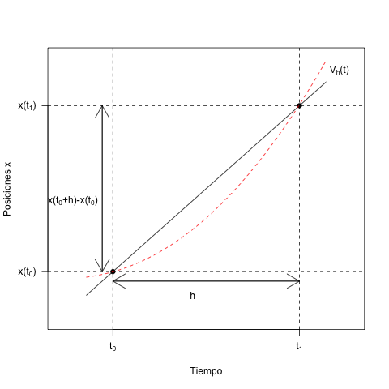

# Introducción

### Modelado Matemático de una Realidad

> "Truth is elusive [...]"
>
>-Yeargers, E., Shonkwiler, R. W., Herod, J. V. An Introduction to the mathematics of Biology.

Los modelos son aproximaciones teóricas a la realidad de un sistema. El generar nuevos modelos es generar nuevas y mejores representaciones. Los modelos solo son aproximaciones debido a dos razones:

- **El universo es sumamente complicado.** Y siempre vamos a estar llegando a nuevas consideraciones teóricas o experimentales sobre lo que anteriormente se consideraba el final.
- Así como en mecánica cuántica se ha demostrado, **nuestros análisis tienden a alterar la realidad** cuando se llega a una resolución suficientemente grande. La "verdad" a la que nos aproximamos es alterada por el mero acto de estudiarla.

Así que los modelos son imperfectos, y por tanto se pueden mejorar con el tiempo. Sin embargo, no es posible tal cosa como una *explicación definitiva*. Siempre que podamos ver las cosas desde perspectivas distintas, surgiran tantas explicaciones como la mente humana puede acceder. Esto nos permite el progreso científico.

### Reduccionismo

El reduccionismo es una idea bastante simple: se toma un fenómeno, y se reduce a sus partes más simples, en un intento de poder entenderlo a partir de sus partes.

Una vez que hemos logrado entender las suficientes partes del sistema podemos llevar a cabo la construcción de una explicación razonable, y tomamos a partir de ese momento un acercamiento *holistico*.

*Es desarmar una licuadora, ver sus mecanismos, y tratar de volver a armarla a partir de la forma de sus piezas.*

### Propiedades de un modelo.

Un buen modelo debe cumplir dos características vitales:

- **Debe ser suficientemente similar al sisttema u objeto de estudio.** Así como debe mostrar las propiedades que nos interesan.

- **Debe de *autodestruirse*.** Esto no es otra cosa más que dar pie a que se pueda poner a prueba. Si el modelo es capaz de predecir el resultado de las pruebas, entonces se puede continuar su uso, de no ser así, debe ser descartado para dar paso a uno nuevo y mejor. La predictibilidad es una pieza clave de un modelo.

#### Ejemplo

Supongamos dos posiciones en un eje: *X(t0)* y *X(t1)*. Donde *h* es el tiempo total para ir de una a otra. O en otras palabras, el tiempo total (*h*) es igual al tiempo final (*t1*) menos el tiempo inicial (*t0*).

&nbsp;&nbsp;&nbsp;&nbsp;

Despejando *t1* de la ecuación, obtenemos que el tiempo final es igual al tiempo total más el tiempo inicial:

&nbsp;&nbsp;&nbsp;&nbsp;

Por lo que podemos considerar a la posición ***X(t1)*** como *x(h+t0)*.

La velocidad es igual a la distancia entre el tiempo. Ya renombramos la posición *x(t1)* como *x(t0+h)*, de manera que tenemos una expresión en función de una sola *t0* y el intervalo de *X(t0)* hasta *X(t1)*. Así podemos expresar la velocidad de la siguiente manera:

&nbsp;&nbsp;&nbsp;&nbsp;

Es decir: La velocidad total en un rango de tiempo *t* es igual a *x(t0+h)* menos *x(t0)*, entre *h*.

De esta manera,  representa la distancia entre ambos puntos. Por esta razón, mientras que *h* representa el factor tiempo, y la diferencia de *x(t1)-x(t0)* el cambio de posición, podemos decir que el cociente entre uno y otro es el valor de la **pendiente**.

Aquí, la **Vh(t)** solo describe una velocidad constante. No hay cambios durante el tiempo, no hay *aceleración*. Si el verdadero trayecto hubiera sido dado por la curva punteada de color rojo, por ejemplo, donde la velocidad va aumentando con el tiempo, entonces el modelo lineal de la velocidad no estaría cercano a la realidad. Nuestro cálculo de la velocidad es una secante a la curva. Si queremos calcularla en un punto excato, tenemos que disminuir la ventana de tiempo; es decir, disminuir *h*.

>La velocidad aumenta con el tiempo porque se recorre una mayor distancia en la misma cantidad de tiempo.

Disminuir *h* disminuye el cociente, con lo que la recta secante disminuye su pendiente. Si *h* es lo suficientemente pequeño, se puede considerar como un solo punto. Esto hace que de secante pase a ser una tangente, es decir, la velocidad que se está calculando sería la **velocidad instantanea**. Un solo punto en la gráfica que podría encontrarse sobre la verdadera curva de velocidad.

Esto se define como el límite cuando *h* tiende a 0 de 

Con *t=t0*, pues es la obseración en un solo punto. Para verla en otro punto se cambia la *t0*. Esto es debido a que cuando *h*->0 podemos considerar a h como un solo punto, o como un espacio de tiempo tan pequeño que es **puntual**.

Y esto es a grandes rasgos una derivada. Donde la pendiente de la recta secante (nuestro cálculo de velocidad) se acerca a la pendiente de la recta tangente (nuestra velocidad instantanea).

Usando una notación más simple podemos expresar la ecuación anterior como:

>Que se puede leer como "la derivada de x(t) con respecto al tiempo".

##### En situaciones ideales

La velocidad de crecimiento de una colonia bacteriana se puede considerar proporcional a la acantidad de bacterias en el tiempo *t*.

*b(t)* es una cantidad de bacterias presentes al instante *t*. Y λ es una **constante de proporcionalidad.**

Cuando *t*=0 el cultivo tiene *b*(0)=b0 de bacterias. Pasada 1 hora (*b*(1)) hay *b*(1) bacterias. Es decir: λ(b0). Por lo que la velocidad de crecimiento de la colonia de bacterias satisface la ecuación:

La cual es una ecuación diferencial ordinaria (ODE) de primer orden. Si sus valores iniciales son *b*(1)=3b0/2 se puede determinar el tiempo necesario para que las bacterias tripliquen su cantidad.

Como esta es solo la *velocidad instantanea* del crecimiento de las bacterias, y queremos encontrarla en un periodo de tiempo mayor, recurrimos a la operación inversa de la derivada: la **integral**.
